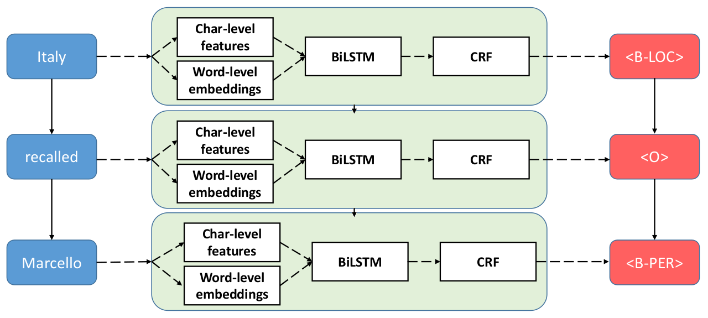

# BiLSTM-CNN-CRF tagger

BiLSTM-CNN-CRF tagger is a PyTorch implementation of "mainstream" neural tagging scheme based on works of [Lample, 
et. al., 2016](https://arxiv.org/pdf/1603.01360.pdf) and [Ma et. al., 2016](https://arxiv.org/pdf/1603.01354.pdf).

<p align="center"></p> 

## Requirements

- python 3.5.2 or higher
- [pytorch 1.0.0](http://pytorch.org/)
- numpy 1.15.1
- scipy 1.1.0

## Benefits

- native PyTorch implementation;
- vectorized code for training on batches;
- easy adding new classes for custom data file formats and evaluation metrics;
- trustworthy evaluation of f1-score.
 
## Project structure

```
|__ articles/ --> collection of papers related to the tagging, argument mining, etc.
|__ data/)
        |__ NER/ --> Datasets for Named Entity Recognition
            |__ CoNNL_2003_shared_task/ --> data for NER CoNLL-2003 shared task (English) in BOI-2
                                            CoNNL format, from E.F. Tjong Kim Sang and F. De Meulder,
                                            Introduction to the CoNLL-2003 Shared Task:
                                            Language-Independent Named Entity Recognition, 2003.
        |__ AM/ --> Datasets for Argument Mining
            |__ persuasive_essays/ --> data for persuasive essays in BOI-2-like CoNNL format, from:
                                       Steffen Eger, Johannes Daxenberger, Iryna Gurevych. Neural
                                       End-to-End  Learning for Computational Argumentation Mining, 2017
|__ docs/ --> documentation
|__ embeddings
        |__ get_glove_embeddings.sh --> script for downloading GloVe6B 100-dimensional word embeddings
        |__ get_fasttext_embeddings.sh --> script for downloading Fasttext word embeddings
|__ pretrained/
        |__ tagger_NER.hdf5 --> tagger for NER, BiLSTM+CNN+CRF trained on NER-2003 shared task, English
src/
|__utils/
   |__generate_tree_description.py --> import os
   |__generate_ft_emb.py --> generate predefined FastText embeddings for dataset
|__models/
   |__tagger_base.py --> abstract base class for all types of taggers
   |__tagger_birnn.py --> Vanilla recurrent network model for sequences tagging.
   |__tagger_birnn_crf.py --> BiLSTM/BiGRU + CRF tagger model
   |__tagger_birnn_cnn.py --> BiLSTM/BiGRU + char-level CNN tagger model
   |__tagger_birnn_cnn_crf.py --> BiLSTM/BiGRU + char-level CNN  + CRF tagger model   
|__data_io/   
   |__data_io_connl_ner_2003.py --> input/output data wrapper for CoNNL file format used in  NER-2003 Shared Task dataset
   |__data_io_connl_pe.py --> input/output data wrapper for CoNNL file format used in Persuassive Essays dataset
   |__data_io_connl_wd.py --> input/output data wrapper for CoNNL file format used in Web Discourse dataset
|__factories/
   |__factory_datasets_bank.py --> creates various datasets banks
   |__factory_data_io.py --> creates various data readers/writers
   |__factory_evaluator.py --> creates various evaluators
   |__factory_optimizer.py --> creates various optimizers
   |__factory_tagger.py --> creates various tagger models   
|__layers/
   |__layer_base.py --> abstract base class for all type of layers   
   |__layer_word_embeddings.py --> class implements word embeddings
   |__layer_char_cnn.py --> class implements character-level convolutional 1D layer
   |__layer_char_embeddings.py --> class implements character-level embeddings
   |__layer_birnn_base.py --> abstract base class for all bidirectional recurrent layers
   |__layer_bivanilla.py --> class implements standard bidirectional Vanilla recurrent layer      
   |__layer_bilstm.py --> class implements standard bidirectional LSTM recurrent layer
   |__layer_bigru.py --> class implements standard bidirectional GRU recurrent layer
   |__layer_crf.py --> class implements Conditional Random Fields (CRF)   
|__evaluators/
   |__evaluator_base.py --> abstract base class for all evaluators
   |__evaluator_acc_token_level.py --> token-level accuracy evaluator for each class of BOI-like tags
   |__evaluator_f1_macro_token_level.py --> macro-F1 scores evaluator for each class of BOI-like tags
   |__evaluator_f1_micro_spans_connl.py --> f1-micro averaging evaluator for tag components, spans detection + classification, uses standard CoNNL perl script
   |__evaluator_f1_micro_spans_alpha_match_base.py --> abstract base class for f1-micro averaging evaluation for tag components, spans detection + classification
   |__evaluator_f1_micro_spans_alpha_match_05.py --> f1-micro averaging evaluation for tag components, spans detection + classification, alpha = 0.5   
   |__evaluator_f1_micro_spans_alpha_match_10.py --> f1-micro averaging evaluation for tag components, spans detection + classification, alpha = 1.0 (strict)   
|__seq_indexers/
   |__seq_indexer_base.py --> base abstract class for sequence indexers
   |__seq_indexer_base_embeddings.py --> abstract sequence indexer class that implements work  with embeddings
   |__seq_indexer_word.py --> converts list of lists of words as strings to list of lists of integer indices and back
   |__seq_indexer_char.py --> converts list of lists of characters to list of lists of integer indices and back
   |__seq_indexer_tag.py --> converts list of lists of string tags to list of lists of integer indices and back
|__classes/
   |__datasets_bank.py --> provides storing the train/dev/test data subsets and sampling batches from the train dataset
   |__report.py --> stores evaluation results during the training process as text files
   |__utils.py --> several auxiliary functions
|__ main.py --> main script for training/evaluation/saving tagger models
|__ run_tagger.py --> run the trained tagger model from the checkpoint file
|__ conlleval --> "official" Perl script from NER 2003 shared task for evaluating the f1 scores,
                   author: Erik Tjong Kim Sang, version: 2004-01-26
|__ requirements.txt --> file for managing packages requirements
```

## Evaluation

Results of training the models with the default settings: 

|         tagger model       |     dataset           | micro-f1 on test        |
| ------------------- | --------------------- | ----------------------- |
| BiLSTM + CNN + CRF [Lample et. al., 2016](https://arxiv.org/pdf/1603.01360.pdf) | NER-2003 shared task (English)  | 90.94 |
| BiLSTM + CNN + CRF [Ma et al., 2016](https://arxiv.org/pdf/1603.01354.pdf)      | NER-2003 shared task (English)  | 91.21 |
| BiLSTM + CNN + CRF  (our)   | NER-2003 shared task (English)                     | 90.86  |          |
In order to ensure the consistency of the experiments, for evaluation purposes we use "official" Perl script from NER 2003 shared task, author: Erik Tjong Kim Sang, version: 2004-01-26, example of it's output:

```
processed 46435 tokens with 5648 phrases; found: 5679 phrases; correct: 5146.
accuracy:  97.92%; precision:  90.61%; recall:  91.11%; FB1:  90.86
              LOC: precision:  91.35%; recall:  93.65%; FB1:  92.48  1710
             MISC: precision:  78.20%; recall:  82.76%; FB1:  80.42  743
              ORG: precision:  90.25%; recall:  88.02%; FB1:  89.12  1620
              PER: precision:  95.95%; recall:  95.30%; FB1:  95.63  1606
``` 

## Usage

### Train/test

To train/evaluate/save trained tagger model, please run the `main.py` script.

```
usage: main.py [-h] [--train TRAIN] [--dev DEV] [--test TEST] [--gpu GPU]
               [--model {BiRNN,BiRNNCNN,BiRNNCRF,BiRNNCNNCRF}]
               [-d {connl-abs,connl-2003}] [--load LOAD] [--save SAVE]
               [-w WORD_SEQ_INDEXER] [-e EPOCH_NUM] [-n MIN_EPOCH_NUM]
               [-p PATIENCE]
               [-v {f1-connl,f1-alpha-match-10,f1-alpha-match-05,f1-macro,token-acc}]
               [--save-best [{yes,True,no default),False}]] [-r DROPOUT_RATIO]
               [-b BATCH_SIZE] [-o {sgd,adam}] [-l LR] [-c LR_DECAY]
               [-m MOMENTUM] [--clip-grad CLIP_GRAD]
               [--rnn-type {Vanilla,LSTM,GRU}]
               [--rnn-hidden-dim RNN_HIDDEN_DIM] [--emb-fn EMB_FN]
               [--emb-dim EMB_DIM] [--emb-delimiter EMB_DELIMITER]
               [--emb-load-all [{yes,True,no (default),False}]]
               [--freeze-word-embeddings [{yes,True,no (default),False}]]
               [--check-for-lowercase [{yes (default),True,no,False}]]
               [--char-embeddings-dim CHAR_EMBEDDINGS_DIM]
               [--char-cnn_filter-num CHAR_CNN_FILTER_NUM]
               [--char-window-size CHAR_WINDOW_SIZE]
               [--freeze-char-embeddings [{yes,True,no (default),False}]]
               [--word-len WORD_LEN]
               [--dataset-sort [{yes,True,no (default),False}]]
               [--seed-num SEED_NUM] [--report-fn REPORT_FN]
               [--verbose [{yes (default,True,no,False}]]

Learning tagger using neural networks

optional arguments:
  -h, --help            show this help message and exit
  --train TRAIN         Train data in CoNNL-2003 format.
  --dev DEV             Dev data in CoNNL-2003 format, it is used to find best
                        model during the training.
  --test TEST           Test data in CoNNL-2003 format, it is used to obtain
                        the final accuracy/F1 score.
  --gpu GPU             GPU device number, -1 means CPU.
  --model {BiRNN,BiRNNCNN,BiRNNCRF,BiRNNCNNCRF}
                        Tagger model.
  -d {connl-abs,connl-2003}, --data-io {connl-abs,connl-2003}
                        Data read/write file format.
  --load LOAD           Path to load from the trained model.
  --save SAVE           Path to save the trained model.
  -w WORD_SEQ_INDEXER, --word-seq-indexer WORD_SEQ_INDEXER
                        Load word_seq_indexer object from hdf5 file.
  -e EPOCH_NUM, --epoch-num EPOCH_NUM
                        Number of epochs.
  -n MIN_EPOCH_NUM, --min-epoch-num MIN_EPOCH_NUM
                        Minimum number of epochs.
  -p PATIENCE, --patience PATIENCE
                        Patience for early stopping.
  -v {f1-connl,f1-alpha-match-10,f1-alpha-match-05,f1-macro,token-acc}, --evaluator {f1-connl,f1-alpha-match-10,f1-alpha-match-05,f1-macro,token-acc}
                        Evaluation method.
  --save-best [{yes,True,no (default),False}]
                        Save best on dev model as a final model.
  -r DROPOUT_RATIO, --dropout-ratio DROPOUT_RATIO
                        Dropout ratio.
  -b BATCH_SIZE, --batch-size BATCH_SIZE
                        Batch size, samples.
  -o {sgd,adam}, --opt-method {sgd,adam}
                        Optimization method.
  -l LR, --lr LR        Learning rate.
  -c LR_DECAY, --lr-decay LR_DECAY
                        Learning decay rate.
  -m MOMENTUM, --momentum MOMENTUM
                        Learning momentum rate.
  --clip-grad CLIP_GRAD
                        Clipping gradients maximum L2 norm.
  --rnn-type {Vanilla,LSTM,GRU}
                        RNN cell units type.
  --rnn-hidden-dim RNN_HIDDEN_DIM
                        Number hidden units in the recurrent layer.
  --emb-fn EMB_FN       Path to word embeddings file.
  --emb-dim EMB_DIM     Dimension of word embeddings file.
  --emb-delimiter EMB_DELIMITER
                        Delimiter for word embeddings file.
  --emb-load-all [{yes,True,no (default),False}]
                        Load all embeddings to model.
  --freeze-word-embeddings [{yes,True,no (default),False}]
                        False to continue training the word embeddings.
  --check-for-lowercase [{yes (default),True,no,False}]
                        Read characters caseless.
  --char-embeddings-dim CHAR_EMBEDDINGS_DIM
                        Char embeddings dim, only for char CNNs.
  --char-cnn_filter-num CHAR_CNN_FILTER_NUM
                        Number of filters in Char CNN.
  --char-window-size CHAR_WINDOW_SIZE
                        Convolution1D size.
  --freeze-char-embeddings [{yes,True,no (default),False}]
                        False to continue training the char embeddings.
  --word-len WORD_LEN   Max length of words in characters for char CNNs.
  --dataset-sort [{yes,True,no (default),False}]
                        Sort sequences by length for training.
  --seed-num SEED_NUM   Random seed number, note that 42 is the answer.
  --report-fn REPORT_FN
                        Report filename.
  --verbose [{yes (default),True,no,False}]
                        Show additional information.
```

### Run trained model

```
usage: run_tagger.py [-h] [--fn FN] [-d {connl-abs,connl-2003}]
                     [--checkpoint_fn CHECKPOINT_FN] [--gpu GPU]
                     [-v {f1-connl,f1-alpha-match-10,f1-alpha-match-05,token-acc}]

Run trained tagger from the checkpoint file

optional arguments:
  -h, --help            show this help message and exit
  --fn FN               Train data in CoNNL-2003 format.
  -d {connl-abs,connl-2003}, --data-io {connl-abs,connl-2003}
                        Data read/write file format.
  --checkpoint_fn CHECKPOINT_FN
                        Path to load the trained model.
  --gpu GPU             GPU device number, 0 by default, -1 means CPU.
  -v {f1-connl,f1-alpha-match-10,f1-alpha-match-05,token-acc}, --evaluator {f1-connl,f1-alpha-match-10,f1-alpha-match-05,token-acc}
                        Evaluation method.
```

### Example of output report

```
Evaluation

batch_size=10
char_cnn_filter_num=30
char_embeddings_dim=25
char_window_size=3
check_for_lowercase=True
clip_grad=5
dataset_sort=True
dropout_ratio=0.5
emb_delimiter=' '
emb_dim=100
emb_fn='embeddings/glove.6B.100d.txt'
epoch_num=100
fn_dev='data/NER/CoNNL_2003_shared_task/dev.txt'
fn_test='data/NER/CoNNL_2003_shared_task/test.txt'
fn_train='data/NER/CoNNL_2003_shared_task/train.txt'
freeze_char_embeddings=False
freeze_word_embeddings=False
gpu=0
load=None
lr=0.01
lr_decay=0.05
match_alpha_ratio=0.999
min_epoch_num=50
model='BiRNNCNNCRF'
momentum=0.9
opt_method='sgd'
patience=20
report_fn='2018_10_09_07-55_14_report.txt'
rnn_hidden_dim=100
rnn_type='LSTM'
save='2018_10_09_07-55_14_tagger.hdf5'
save_best=False
seed_num=42
verbose=True
word_len=20
wsi=None

     epoch  | train loss |   f1-train |     f1-dev |    f1-test | acc. train |   acc. dev |  acc. test 
---------------------------------------------------------------------------------------------------------
          1 |     302.08 |      82.69 |      83.02 |      80.19 |      95.68 |      95.59 |      95.20 
          2 |     151.72 |      89.32 |      88.63 |      84.90 |      97.66 |      97.43 |      96.56 
          3 |     108.10 |      91.76 |      90.80 |      87.84 |      98.35 |      98.08 |      97.37 
          4 |      88.41 |      92.41 |      90.64 |      88.01 |      98.51 |      98.11 |      97.44 
          5 |      75.45 |      93.66 |      91.76 |      89.20 |      98.76 |      98.28 |      97.53 
          6 |      67.20 |      94.45 |      92.35 |      89.94 |      98.92 |      98.40 |      97.78 
          7 |      61.48 |      95.35 |      92.96 |      89.94 |      99.10 |      98.53 |      97.78 
          8 |      56.26 |      95.38 |      92.34 |      89.62 |      99.11 |      98.44 |      97.67 
          9 |      52.61 |      95.68 |      92.35 |      89.43 |      99.16 |      98.44 |      97.57 
         10 |      48.84 |      96.44 |      93.18 |      90.20 |      99.31 |      98.61 |      97.77 
         11 |      45.93 |      96.53 |      92.79 |      90.10 |      99.34 |      98.52 |      97.76 
         12 |      42.84 |      96.71 |      93.12 |      89.99 |      99.33 |      98.53 |      97.59 
         13 |      40.87 |      97.11 |      93.34 |      90.31 |      99.46 |      98.64 |      97.79 
         14 |      39.28 |      97.32 |      93.51 |      90.39 |      99.49 |      98.66 |      97.81 
         15 |      37.28 |      97.51 |      93.50 |      90.32 |      99.53 |      98.67 |      97.84 
         16 |      35.54 |      97.52 |      93.44 |      90.09 |      99.54 |      98.65 |      97.68 
         17 |      33.91 |      97.37 |      93.73 |      89.89 |      99.50 |      98.69 |      97.71 
         18 |      32.79 |      97.83 |      93.38 |      90.88 |      99.61 |      98.65 |      97.96 
         19 |      30.78 |      97.86 |      93.72 |      90.23 |      99.62 |      98.69 |      97.76 
         20 |      30.02 |      98.13 |      93.79 |      90.78 |      99.66 |      98.66 |      97.90 
         21 |      29.37 |      98.06 |      93.62 |      90.03 |      99.65 |      98.70 |      97.75 
         22 |      27.77 |      98.07 |      93.95 |      90.56 |      99.64 |      98.74 |      97.87 
         23 |      26.41 |      98.12 |      93.20 |      90.30 |      99.67 |      98.61 |      97.80 
         24 |      26.69 |      98.40 |      94.03 |      90.77 |      99.71 |      98.76 |      97.91 
         25 |      24.89 |      98.53 |      93.67 |      90.75 |      99.74 |      98.72 |      97.92 
         26 |      24.18 |      98.57 |      93.80 |      90.70 |      99.73 |      98.69 |      97.90 
         27 |      23.72 |      98.68 |      94.18 |      90.84 |      99.78 |      98.79 |      97.93 
         28 |      23.80 |      98.71 |      94.13 |      90.60 |      99.78 |      98.78 |      97.87 
         29 |      22.46 |      98.55 |      93.68 |      90.48 |      99.72 |      98.67 |      97.82 
         30 |      22.25 |      98.72 |      93.91 |      90.78 |      99.78 |      98.72 |      97.88 
         31 |      21.56 |      98.81 |      94.10 |      90.38 |      99.80 |      98.76 |      97.76 
         32 |      20.95 |      98.94 |      94.36 |      90.60 |      99.81 |      98.82 |      97.82 
         33 |      20.11 |      98.93 |      94.31 |      90.79 |      99.83 |      98.84 |      97.94 
         34 |      20.87 |      98.83 |      93.98 |      90.46 |      99.80 |      98.78 |      97.84 
         35 |      19.16 |      98.93 |      94.00 |      90.57 |      99.81 |      98.73 |      97.88 
         36 |      18.78 |      98.99 |      93.90 |      90.56 |      99.82 |      98.72 |      97.87 
         37 |      18.26 |      99.15 |      94.19 |      90.74 |      99.86 |      98.78 |      97.92 
         38 |      18.33 |      98.93 |      94.23 |      90.69 |      99.80 |      98.77 |      97.88 
         39 |      18.16 |      99.16 |      94.18 |      90.66 |      99.86 |      98.77 |      97.90 
         40 |      16.65 |      99.20 |      94.35 |      90.91 |      99.87 |      98.84 |      97.94 
         41 |      17.50 |      99.24 |      93.95 |      90.76 |      99.87 |      98.72 |      97.91 
         42 |      17.74 |      99.28 |      94.14 |      90.76 |      99.89 |      98.81 |      97.93 
         43 |      18.12 |      99.24 |      94.06 |      90.63 |      99.88 |      98.79 |      97.91 
         44 |      16.16 |      99.24 |      94.10 |      90.61 |      99.88 |      98.78 |      97.90 
         45 |      15.82 |      99.31 |      94.10 |      90.64 |      99.89 |      98.78 |      97.86 
         46 |      15.76 |      99.29 |      94.26 |      90.64 |      99.90 |      98.80 |      97.93 
         47 |      14.65 |      99.28 |      93.96 |      90.42 |      99.87 |      98.72 |      97.80 
         48 |      14.84 |      99.45 |      94.30 |      90.97 |      99.92 |      98.82 |      97.93 
         49 |      15.59 |      99.39 |      94.13 |      90.75 |      99.91 |      98.79 |      97.84 
         50 |      13.84 |      99.39 |      94.07 |      91.10 |      99.91 |      98.78 |      98.00 
         51 |      15.17 |      99.39 |      94.16 |      90.97 |      99.90 |      98.79 |      97.94 
         52 |      14.33 |      99.42 |      94.16 |      90.64 |      99.91 |      98.80 |      97.84 
         53 |      13.90 |      99.56 |      94.48 |      90.82 |      99.94 |      98.84 |      97.89 
         54 |      14.36 |      99.50 |      94.20 |      90.92 |      99.93 |      98.80 |      97.94 
         55 |      14.41 |      99.40 |      94.15 |      90.50 |      99.90 |      98.78 |      97.85 
         56 |      13.52 |      99.55 |      94.28 |      90.73 |      99.93 |      98.82 |      97.87 
         57 |      12.61 |      99.51 |      94.21 |      90.60 |      99.92 |      98.79 |      97.85 
         58 |      12.89 |      99.49 |      94.17 |      90.78 |      99.92 |      98.78 |      97.90 
         59 |      12.60 |      99.51 |      94.17 |      90.57 |      99.92 |      98.79 |      97.83 
         60 |      13.01 |      99.48 |      93.84 |      90.46 |      99.92 |      98.72 |      97.81 
         61 |      12.94 |      99.53 |      94.06 |      90.65 |      99.93 |      98.77 |      97.84 
         62 |      12.36 |      99.58 |      93.99 |      90.55 |      99.93 |      98.76 |      97.83 
         63 |      11.82 |      99.54 |      94.27 |      90.76 |      99.92 |      98.80 |      97.90 
         64 |      12.09 |      99.59 |      94.25 |      90.79 |      99.94 |      98.79 |      97.89 
         65 |      12.10 |      99.54 |      94.20 |      90.67 |      99.93 |      98.81 |      97.85 
         66 |      11.72 |      99.49 |      94.31 |      90.76 |      99.92 |      98.83 |      97.89 
         67 |      11.43 |      99.58 |      94.22 |      90.86 |      99.94 |      98.83 |      97.90 
         68 |      11.05 |      99.60 |      94.06 |      90.75 |      99.94 |      98.76 |      97.88 
         69 |      10.50 |      99.63 |      94.21 |      90.77 |      99.94 |      98.78 |      97.88 
         70 |      10.85 |      99.55 |      94.19 |      90.74 |      99.93 |      98.79 |      97.87 
         71 |      11.22 |      99.64 |      94.27 |      90.80 |      99.95 |      98.80 |      97.90 
         72 |      11.51 |      99.60 |      94.24 |      90.77 |      99.94 |      98.79 |      97.90 
         73 |      10.90 |      99.70 |      94.02 |      90.70 |      99.95 |      98.75 |      97.87 
         74 |       9.90 |      99.67 |      94.11 |      90.86 |      99.95 |      98.77 |      97.92 
---------------------------------------------------------------------------------------------------------
Final eval on test,  micro-f1 test = 74) = 90.86
```
###

Training on NER-2003 Shared dataset:
```
python3 main.py
```

Training on Peruassive Essays dataset:
```
python3 --train data/AM/persuasive_essays/Essay_Level/train.dat.abs --dev data/AM/persuasive_essays/Essay_Level/dev.dat.abs --test data/AM/persuasive_essays/Essay_Level/test.dat.abs --data-io connl-pe --opt adam --lr 0.001 --save-best yes
```

Training on Web Discourse dataset (cross-validation):
```
python3 main.py --train data/AM/web_discourse --evaluator f1-macro --data-io connl-wd --opt adam --lr 0.001 --save-best yes -w w_wd --cross-folds-num 10 --cross-fold-id 1;
python3 main.py --train data/AM/web_discourse --evaluator f1-macro --data-io connl-wd --opt adam --lr 0.001 --save-best yes -w w_wd --cross-folds-num 10 --cross-fold-id 2;
python3 main.py --train data/AM/web_discourse --evaluator f1-macro --data-io connl-wd --opt adam --lr 0.001 --save-best yes -w w_wd --cross-folds-num 10 --cross-fold-id 3;
python3 main.py --train data/AM/web_discourse --evaluator f1-macro --data-io connl-wd --opt adam --lr 0.001 --save-best yes -w w_wd --cross-folds-num 10 --cross-fold-id 4;
python3 main.py --train data/AM/web_discourse --evaluator f1-macro --data-io connl-wd --opt adam --lr 0.001 --save-best yes -w w_wd --cross-folds-num 10 --cross-fold-id 5;
python3 main.py --train data/AM/web_discourse --evaluator f1-macro --data-io connl-wd --opt adam --lr 0.001 --save-best yes -w w_wd --cross-folds-num 10 --cross-fold-id 6;
python3 main.py --train data/AM/web_discourse --evaluator f1-macro --data-io connl-wd --opt adam --lr 0.001 --save-best yes -w w_wd --cross-folds-num 10 --cross-fold-id 7;
python3 main.py --train data/AM/web_discourse --evaluator f1-macro --data-io connl-wd --opt adam --lr 0.001 --save-best yes -w w_wd --cross-folds-num 10 --cross-fold-id 8;
python3 main.py --train data/AM/web_discourse --evaluator f1-macro --data-io connl-wd --opt adam --lr 0.001 --save-best yes -w w_wd --cross-folds-num 10 --cross-fold-id 9;
python3 main.py --train data/AM/web_discourse --evaluator f1-macro --data-io connl-wd --opt adam --lr 0.001 --save-best yes -w w_wd --cross-folds-num 10 --cross-fold-id 10;
```

### Alternative neural taggers

- NeuroNER (Tensorflow) [https://github.com/Franck-Dernoncourt/NeuroNER](https://github.com/Franck-Dernoncourt/NeuroNER)
- LM-LSTM-CRF (Pytorch) [https://github.com/LiyuanLucasLiu/LM-LSTM-CRF](https://github.com/LiyuanLucasLiu/LM-LSTM-CRF)
- LD-Net (Pytorch) [https://github.com/LiyuanLucasLiu/LD-Net](https://github.com/LiyuanLucasLiu/LD-Net)
- LSTM-CRF in PyTorch (Pytorch) [https://github.com/threelittlemonkeys/lstm-crf-pytorch](https://github.com/threelittlemonkeys/lstm-crf-pytorch) 
- UKPLab/emnlp2017-bilstm-cnn-crf (Tensorflow & Keras)
[https://github.com/UKPLab/emnlp2017-bilstm-cnn-crf](https://github.com/UKPLab/emnlp2017-bilstm-cnn-crf)
- UKPLab/elmo-bilstm-cnn-crf (Tensorflow & Keras)
[https://github.com/UKPLab/elmo-bilstm-cnn-crf](https://github.com/UKPLab/elmo-bilstm-cnn-crf)

